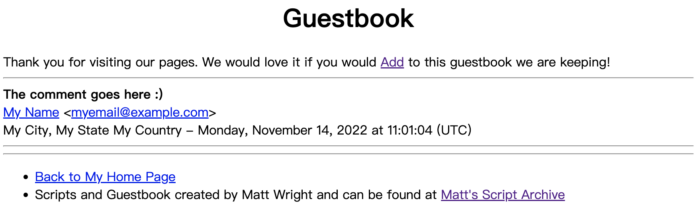
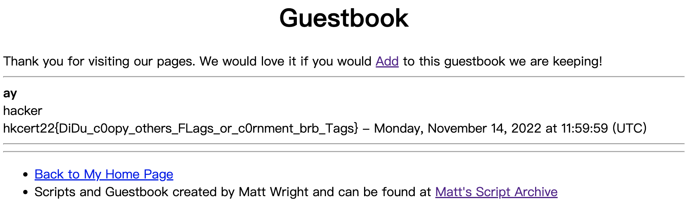

# CVE 1999 (香港生產力促進局)
> Tag: web, 2 stars, 199 points
>
> Web: <http://chal-a.hkcert22.pwnable.hk:28229/~matt/guestbook.html>, <http://chal-b.hkcert22.pwnable.hk:28229/~matt/guestbook.html> 

## Challenge Description

The website is a guestbook system, which allows users to add comments to the web page.
The name, e-mail, URL, city, state and country are also displayed.



Users can create a new guestbook entry on `/~matt/addguest.html`.
The form is POSTed to `/~matt/cgi-bin/guestbook.pl` to handle the action:
- If you leave the comments empty, the page asks for the comments and allows you to edit the other fields.
- If you leave the name empty, the page asks for the name but retains the comments.

The guestbook is cleared every minute.

## Background

The challenge references Matt's Script Archive and the Common Vulnerabilities and Exposures (CVE) system.

On Matt's Script Archive, [Guestbook](http://www.scriptarchive.com/guestbook.html) is one of the scripts that you can freely download.
The source code of `guestbook.pl` can be found [there](http://www.scriptarchive.com/download.cgi?s=guestbook&c=txt&f=guestbook%2Epl).

From [Wikipedia](https://en.wikipedia.org/wiki/Matt%27s_Script_Archive), Matt's Script Archive stores CGI scripts
written in Perl. However, they were criticized for being insecure.

Next, a Google search of "CVE 1999 Matt" reveals a vulnerability [CVE-1999-1053](https://www.cvedetails.com/cve/CVE-1999-1053/)
about this exact script. Its description reads:
> guestbook.pl cleanses user-inserted SSI commands by removing text between "<!--" and "-->" separators,
> which allows remote attackers to execute arbitrary commands when guestbook.pl is run on Apache 1.3.9 and possibly other versions,
> since Apache allows other closing sequences besides "-->".

## Failed Attempts

- The website is subject to XSS by including HTML code in the comments,
but this is not useful for getting the flag.
- After providing a PutsReq URL and a disposable email address, we found that
the website does not visit the URL entered or send an email to the email adress.
- There doesn't seem to have any other user than `/~matt`.
- The Perl script uses `open` to send email.
However, command injection does not work since `$mail` and `$remote_mail` were disabled.

## The Vulnerability

In [this article](http://www.ouah.org/hackingcgi.htm) by b0iler,
they introduced common exploits of CGI scripts, including Server Side Includes (SSI).

When the printed HTML file contains `<!--#[directive] ... -->`, SSI replaces it with a generated string.
For example,
- `<!--#include file="filename.txt" -->` includes the content of `filename.txt`, and
- `<!--#exec cmd="ls" -->` includes the output of `ls`.

As a result, we want to include `<!--#exec cmd="cat /flag" -->` in the guestbook.

However, each field is sanitized before handling:
```perl
foreach $pair (@pairs) {
   ($name, $value) = split(/=/, $pair);
   # ...
   $value =~ s/<!--(.|\n)*-->//g;
   # ...
   $FORM{$name} = $value;
}
```

But we can bypass this by spliting the payload into two parts, and putting them in different fields.

## Solution

Add the following entry:
- State: `<!--#exec cmd="cat /flag"`
- Country: `-->`

and check the guestbook.



## Flag
```
hkcert22{DiDu_c0opy_others_FLags_or_c0rnment_brb_Tags}
```
